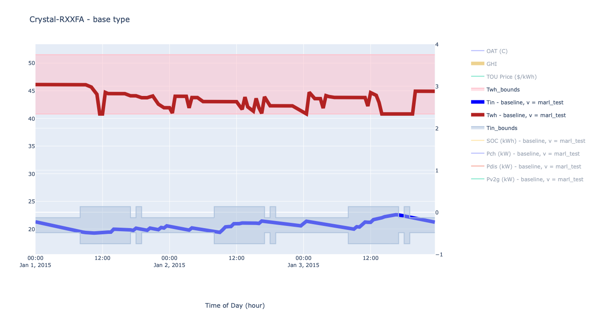

.. DRAGG documentation master file, created by
   sphinx-quickstart on Thu Oct  6 14:58:49 2022.
   You can adapt this file completely to your liking, but it should at least
   contain the root `toctree` directive.

Distributed Resource AGGregator (DRAGG)
=================================

DRAGG is a Python based package for creating approximate load profiles of single family homes. DRAGG's thermal models can be used to validate demand response from consumers (e.g. maintaining thermal comfort and safety) while providing the corresponding demand. The thermal models in DRAGG are stochastically initialized to emulate the diversity of a typical residential community.

Each consumer within DRAGG is represented via a `Model Predictive Control <https://en.wikipedia.org/wiki/Model_predictive_control>`_ Home Energy Management System (HEMS) with the objective to minimize their personal cost: cost per kWh by kWh consumed over the duration of the simualtion. To manipulate consumption the base HEMS is equipped with an electric HVAC system (based on a heat pump), an electric resistance water heater, and an electric vehicle that is capable of vehicle-to-grid charging. Optionally the HEMS can be equipped with a PV array and home battery.

Every system is approximated by a set of `mixed-integer linear programming <https://en.wikipedia.org/wiki/Integer_programming>`_ constraints which can be used to approximate the `duty cycle <https://en.wikipedia.org/wiki/Duty_cycle>`_ of the HVAC and water heater respectively. 

Contents
-----
.. toctree::
   :maxdepth: 1
   
   getting_started
   dragg
   dragg.devices
   
.. note:: DRAGG is still under development and we welcome feature requests or collaboration.
